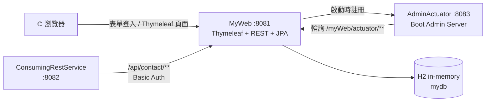
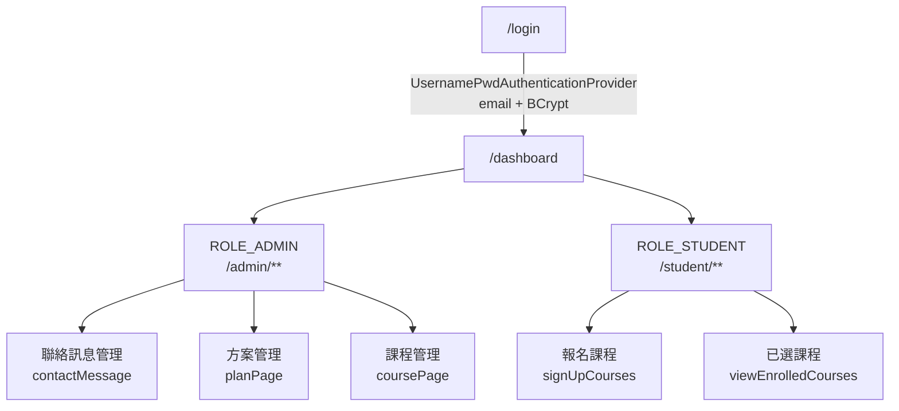
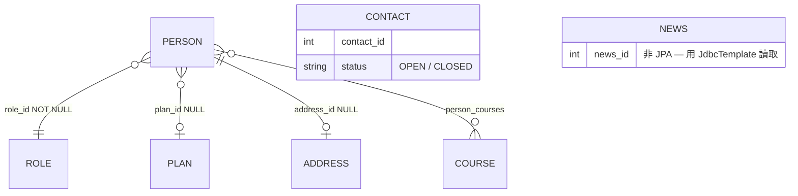

# springboot-webapp

> **一個 Spring Boot 4.1 + Java 25 的多模組練習場** — 用三個可獨立啟動的應用，把 Web MVC、REST API、微服務通訊與應用監控四件事完整串起來。

主應用對外的產品名是 **SpringWise** — 一個模擬的線上課程學習平台，權限分三層：

| 角色 | 可以做什麼 |
|---|---|
| **匿名訪客** | 首頁、關於我們（`/about`）、最新消息（`/news`）、聯絡我們（`/contact`）、註冊帳號 |
| **學生**（`ROLE_STUDENT`） | 以上全部 ＋ **瀏覽可選課程與選課**（`/student/**`）、個人儀表板、編輯個人資料 |
| **管理員**（`ROLE_ADMIN`） | 以上全部 ＋ 課程／方案／聯絡訊息後台（`/admin/**`）、REST API、Spring Data REST、Actuator |

> 📌 **課程清單不對外公開** — 連「看有哪些課」都需要先登入學生帳號，課程相關頁面全部掛在 `/student/**` 底下。

整個 repo 的重點不在業務複雜度，而在**同一份資料用多種 Spring 技術棧實作一遍**，方便對照學習。

<p>
  
  
  
  
  
  
  
</p>

| 模組 | Port | 一句話定位 |
|---|---|---|
| [`MyWeb`](./MyWeb) | **8081** | 主應用「**SpringWise**」— Thymeleaf 前端 + 表單登入 + REST API + Spring Data REST + Actuator client |
| [`ConsumingRestService`](./ConsumingRestService) | **8082** | REST client 教學 — 用 **OpenFeign / RestTemplate / WebClient** 三種寫法呼叫 `MyWeb` |
| [`AdminActuator`](./AdminActuator) | **8083** | **Spring Boot Admin Server** — 監控 `MyWeb` 的 Web UI |

> 三個模組**沒有父層聚合 POM**，各自帶 `pom.xml` 與 Maven Wrapper，必須進到各自目錄才能建置或執行。

---

## 目錄

1. [視覺展示](#1-視覺展示)
2. [系統架構與專案結構](#2-系統架構與專案結構)
3. [核心功能與亮點](#3-核心功能與亮點)
4. [技術棧](#4-技術棧)
5. [快速開始與本地部署](#5-快速開始與本地部署)
6. [附錄](#6-附錄)

---

## 1. 視覺展示

### 請求流向一覽



### 登入後的角色分流



### 畫面截圖

> 展開下方分組可看其餘 9 張；所有截圖放在 [`docs/screenshots/`](./docs/screenshots)。

#### 首頁


<details>
<summary><b>🔓 前台（不需登入）— 登入頁、註冊頁</b></summary>

<br>

**登入** — `/login`，由自訂的 `UsernamePwdAuthenticationProvider` 以 email + BCrypt 驗證


**註冊** — `/public/register`，表單 POST 到 `/public/createUser`，套用 `@PasswordValidator` 與 `@FieldValueMatchValidator`


</details>

<details>
<summary><b>👤 登入後 — 個人儀表板、個人資料</b></summary>

<br>

**個人儀表板** — `/dashboard`，依角色顯示不同入口（圖為 `ROLE_ADMIN`，有「查看聯絡訊息／管理方案／管理課程」三張卡片）


**個人資料** — `/profilePage`，以 `Profile` DTO（非 Entity）承載表單，含基本資料與地址資料


</details>

<details>
<summary><b>🛠️ 管理員後台 — 聯絡訊息、方案管理</b></summary>

<br>

**聯絡訊息** — `/admin/viewContactMessage/page/1`，**每頁 5 筆**（由 `myweb.paginationPageSize` 控制）、欄位可排序，右側「關閉」把狀態從 `OPEN` 改為 `CLOSED`


**方案管理** — `/admin/planPage`，`Plan` 的 CRUD；「查看」進入 `viewPlanDetail` 可增減該方案的學生


</details>

<details>
<summary><b>🎓 學生 — 選課</b></summary>

<br>

**可選課程** — `/student/signUpCourses`，勾選後批次購買；已報名的課程會被 disable（由 `alreadyRegisteredCourses` 判斷）


</details>

<details>
<summary><b>🔧 開發者工具 — HAL Explorer、Boot Admin</b></summary>

<br>

**HAL Explorer** — `/spring-data-api/`，Spring Data REST 自動產生端點的互動式瀏覽器（需 `ROLE_ADMIN`）


**Spring Boot Admin** — <http://localhost:8083>，可看健康狀態、執行緒、CPU、環境變數、Bean、Logfile；左側「日誌」分頁能**線上調整 log level 免重啟**


</details>

---

## 2. 系統架構與專案結構

### 模組間的通訊契約

```
┌────────────────────────────┐                              ┌──────────────────────────────┐
│ ConsumingRestService :8082 │                              │ MyWeb                  :8081 │
├────────────────────────────┤                              ├──────────────────────────────┤
│ [1] Feign         GET      │─ getContactMessageByStatus ─>│ /api/contact/**              │
│ [2] RestTemplate  POST     │───── saveContactMessage ────>│   requires ROLE_ADMIN        │
│ [3] WebClient     POST     │───── saveContactMessage ────>│                              │
│                            │                              │ Thymeleaf UI                 │
│ Basic Auth preset:         │                              │ Spring Data REST             │
│ admin@gmail.com / admin    │                              │ Spring Security              │
└────────────────────────────┘                              │ H2 (in-memory)               │
                                                            │                              │
┌────────────────────────────┐                              │ /myWeb/actuator/**           │
│ AdminActuator     :8083    │<─── [4] register on boot ────│   requires ROLE_ADMIN        │
├────────────────────────────┤                              │                              │
│ Boot Admin Server UI       │─── [5] poll (Basic Auth) ───>│                              │
└────────────────────────────┘                              └──────────────────────────────┘
```

| # | 呼叫 | 說明 |
|---|---|---|
| **[1]** | Feign → `GET /api/contact/getContactMessageByStatus` | 宣告式 client，`OpenFeignRestClient` 介面無實作，由 Feign 在執行期動態代理 |
| **[2]** | RestTemplate → `POST /api/contact/saveContactMessage` | 阻塞式呼叫，手動組 `HttpHeaders` + `HttpEntity` 再 `exchange()` |
| **[3]** | WebClient → `POST /api/contact/saveContactMessage` | 反應式呼叫，流暢 API 串接 `.header().body().retrieve()` |
| **[4]** | MyWeb **主動**向 8083 註冊 | 啟動時送出 service / management base-url |
| **[5]** | AdminActuator 反向定期輪詢 | Basic Auth 且 **無 session** — 每次輪詢都重新驗證一次 |

各模組的職責與依賴方向：

| 模組 | 對外提供 | 依賴誰 |
|---|---|---|
| **MyWeb** `:8081` | Thymeleaf UI、`/api/contact/**`、Spring Data REST、Actuator、H2、Spring Security | 無（可獨立啟動） |
| **ConsumingRestService** `:8082` | `/getMessages`、`/saveMessages`、`/saveMessagesWebClient` | **MyWeb**（三個 client 的目標網址都寫死在原始碼裡） |
| **AdminActuator** `:8083` | Boot Admin Server Web UI | 被 MyWeb 註冊，再反向持續輪詢 MyWeb |

**啟動相依性**：`MyWeb` 可獨立跑；`MyWeb` 預設會向 8083 註冊（`spring.boot.admin.client.enabled=true`），所以 **`AdminActuator` 建議先啟動**，否則 console 會一直刷連線失敗。

### 目錄結構

```
springboot-webapp/
├── MyWeb/                              # 主應用（8081）
│   └── src/main/
│       ├── java/com/company/myweb/
│       │   ├── MyWebApplication.java   # @SpringBootApplication + @EnableJpaAuditing + @EnableConfigurationProperties
│       │   ├── aspect/                 # LoggerAspect — @Around 計時、@AfterThrowing 記錄例外
│       │   ├── auditor/                # AuditAwareImpl — 提供 @CreatedBy / @LastModifiedBy 的值
│       │   ├── config/                 # MyWebConfig、MyWebProperties、GlobalExceptionHandler
│       │   │   └── security/           # SpringSecurityConfig、UsernamePwdAuthenticationProvider
│       │   ├── constant/               # ProjectConstant（ANSI 顏色碼、狀態常數）
│       │   ├── controller/             # @Controller（Thymeleaf）
│       │   │   └── authenticated/      # 登入後頁面：Dashboard / Profile / Admin / Student
│       │   ├── exception/              # 自訂例外
│       │   ├── model/                  # JPA Entity + 2 個「非 Entity」類別
│       │   ├── myValidation/           # 自訂 Bean Validation
│       │   ├── repository/             # Spring Data JPA Repository
│       │   ├── rest/                   # @RestController（/api/**）+ REST 例外處理
│       │   └── service/                # 寫入與跨 repository 的業務邏輯
│       └── resources/
│           ├── sql/schema.sql          # ⚠️ schema 的唯一真相（ddl-auto=validate）
│           ├── sql/data.sql            # 初始資料（含 BCrypt 加密的預設帳號）
│           ├── static/css/             # app.css → foundation / components / pages 三層 @import
│           └── templates/              # Thymeleaf；nav/、authenticated/、fragments/
│
├── ConsumingRestService/               # REST client 教學（8082）
│   └── src/main/java/com/company/ConsumingRestService/
│       ├── config/ProjectConfiguration.java   # 三個 client bean，各自預設 Basic Auth
│       ├── controller/ContactRestController.java
│       ├── dto/                        # Contact / Response（獨立複製的 POJO，非共用 jar）
│       └── proxy/
│           └── OpenFeignRestClient.java  # @FeignClient 宣告式介面
│
└── AdminActuator/                      # Boot Admin Server（8083）
    └── src/main/java/com/company/AdminActuator/
        └── AdminActuatorApplication.java      # 只有 @EnableAdminServer
```

### 資料模型



| 符號 | 讀作 |
|---|---|
| `\|\|` | 剛好一筆（必填） |
| `o\|` | 零或一筆（選填） |
| `}o` / `o{` | 零到多筆 |

逐條關聯：

| 關聯 | 讀法 | 外鍵位置 |
|---|---|---|
| `PERSON }o--\|\| ROLE` | 多個使用者共用一個角色；**每個使用者一定要有角色** | `person.role_id` **NOT NULL** |
| `PERSON }o--o\| PLAN` | 多個使用者可屬於同一方案；**也可以沒有方案** | `person.plan_id` **NULL** |
| `PERSON \|\|--o\| ADDRESS` | 一個使用者最多一筆地址；**註冊時不填，之後在個人資料補** | `person.address_id` **NULL** |
| `PERSON }o--o{ COURSE` | 一個學生可選多門課，一門課可被多人選 | 中介表 `person_courses` |
| `CONTACT`、`NEWS` | 獨立資料表，沒有任何外鍵 | 無 |

#### 這些關聯寫在哪

**四個關聯全部宣告在 `model/Person.java` 一個檔案裡** —— 因為外鍵欄位都在 `person` 表上：

```java
// Person.java

@ManyToOne(fetch = FetchType.EAGER, optional = false)      // 多對一，且必填
@JoinColumn(name = "role_id", nullable = false)            // 存進 person.role_id
private Role roles;                                        // 型別 Role → 指向 roles 表

@OneToOne(fetch = FetchType.EAGER, cascade = {CascadeType.MERGE})
@JoinColumn(name = "address_id")                           // 存進 person.address_id（可為 NULL）
private Address address;                                   // 型別 Address → 指向 address 表

@ManyToOne(fetch = FetchType.EAGER)                        // optional 預設 true → 選填，可為 null
@JoinColumn(name = "plan_id")                              // 存進 person.plan_id（nullable 預設 true）
private Plan plan;                                         // 型別 Plan → 指向 plan 表

@ManyToMany(fetch = FetchType.EAGER)
@JoinTable(name = "person_courses",                            // 中介表名稱
        joinColumns = @JoinColumn(name = "person_id"),         // 指回「本類別 Person」→ person_courses.person_id
        inverseJoinColumns = @JoinColumn(name = "course_id"))  // 指向「集合元素 Course」→ person_courses.course_id
private Set<Course> courses = new HashSet<>();                 // 型別 Course → 指向 courses 表
```

三個補充重點：

1. **外鍵全部集中在 `person` 表上** —— `role_id`、`address_id`、`plan_id` 三個欄位都在 `person`，所以 `PERSON` 是這張圖唯一的「中心」，其他表彼此不相連。
2. **`person_courses` 是純中介表** —— 只有 `person_id` + `course_id` 兩欄，並以兩者為**複合主鍵**，因此同一個學生無法重複報名同一門課（資料庫層級就擋掉）。
3. **`Person` 的四個關聯全都是 owning side** —— 判準是「誰身上有 `@JoinColumn` / `@JoinTable`」，也就是誰管著外鍵；因為外鍵都在 `person` 表，所以四個都歸 `Person`。其中兩個是**單向**（`Role`、`Address` 沒有指回 `Person` 的欄位，根本沒有 inverse side），另外兩個是**雙向** —— `Plan.persons`、`Course.persons` 標了 `mappedBy`，是**唯讀視角**，直接改動它們不會寫進資料庫（見 `AdminController.addStudent`：必須 `person.setPlan(...)` 再存 `Person` 才有效）。

| 類別 | 類型 | 注意事項 |
|---|---|---|
| `Person` | JPA Entity | 關聯**全部 `FetchType.EAGER`**；**刻意覆蓋** `BaseEntity.createdBy`，讓未登入註冊也能寫入 |
| `Role`、`Address`、`Plan`、`Course`、`Contact` | JPA Entity | `Plan.persons` 是唯一的 `LAZY` 關聯 |
| `BaseEntity` | `@MappedSuperclass` | 稽核欄位 `createdBy` / `createdAt` / `updatedBy` / `updatedAt` |
| `News` | **純 POJO** ⚠️ | 用 `JdbcTemplate` + `BeanPropertyRowMapper` 讀取，`news` 表只存在於 `schema.sql`。**勿加 `@Entity`** |
| `Profile` | **DTO** ⚠️ | 更新個人資料表單專用，不入庫 |

---

## 3. 核心功能與亮點

### 🔐 Spring Security 的完整應用面

安全性設定集中在 `config/security/`，涵蓋**認證、授權、密碼、CSRF、前端整合**五個面向。

#### ① 認證 — 自訂 `AuthenticationProvider`，不走預設的 `UserDetailsService`

`UsernamePwdAuthenticationProvider` 直接實作 `AuthenticationProvider`，以 **email** 查 `person` 表、用 `BCryptPasswordEncoder` 比對，並手動組出 `ROLE_` 前綴的 `GrantedAuthority`。

官方建議做法是只寫 `UserDetailsService`（負責查使用者，密碼比對交給 Spring 內建的 `DaoAuthenticationProvider`）。這裡刻意往下一層寫，**把整條驗證鏈攤開來**，方便理解流程。

#### ② 授權 — 路徑規則

| 路徑 | 需要權限 |
|---|---|
| `/student/**` | `ROLE_STUDENT` |
| `/admin/**`、`/api/**`、`/spring-data-api/**`、`/myWeb/actuator/**` | `ROLE_ADMIN` |
| `/dashboard`、`/profilePage`、`/updateProfile` | 任何已登入使用者 |
| 其他（`/`、`/login`、`/public/**`、H2 console…） | `permitAll` |

`hasRole("ADMIN")` 比對的實際字串是 `ROLE_ADMIN` —— 前綴由 provider 的 `getGrantedAuthorities()` 加上。

#### ③ 兩種登入方式並存

| 方式 | 用途 | 設定 |
|---|---|---|
| **表單登入** | 瀏覽器使用者 | `http.formLogin(...)` — 登入頁 `/login`、成功導 `/dashboard`、失敗導 `/login?error=true` |
| **HTTP Basic** | AdminActuator 輪詢、REST client 呼叫 | `http.httpBasic(...)` — 無 session，每個請求都重新驗證 |

#### ④ CSRF — 預設全開，四個路徑豁免

```java
http.csrf(csrf -> csrf
        .ignoringRequestMatchers(PathRequest.toH2Console())  // H2 console 的表單不合規
        .ignoringRequestMatchers("/api/**")                  // 吃 JSON、由程式呼叫
        .ignoringRequestMatchers("/spring-data-api/**")
        .ignoringRequestMatchers("/myWeb/actuator/**"));
```

判準是「**是不是瀏覽器表單提交**」—— 是就要 CSRF token，不是就豁免。

#### ⑤ 前端整合 — Thymeleaf 依角色顯示不同內容

`thymeleaf-extras-springsecurity6` 提供 `sec:` 屬性，讓模板直接判斷登入狀態與角色：

```html
<div sec:authorize="hasRole('ROLE_ADMIN')">  <!-- dashboard.html：只有管理員看得到 -->
<a sec:authorize="isAuthenticated()" th:href="@{/dashboard}">個人儀表板</a>
<a sec:authorize="isAnonymous()" th:href="@{/login}">登入</a>   <!-- navbar.html -->
```

#### ⑥ 稽核串接

`AuditAwareImpl` 從 `SecurityContextHolder` 取出登入者 email，餵給 `@CreatedBy` / `@LastModifiedBy`；未登入時退回 `"anonymousUser"`。

### 🧩 同一份資料，四種存取風格並陳

這是本專案最主要的教學價值 — 同一個 `Contact` 資料，用四種方式對外：

| 風格 | 進入點 | 特色 |
|---|---|---|
| **Thymeleaf MVC** | `/contact` | 伺服器端渲染 HTML |
| **手寫 REST** | `/api/contact/**` | 完全掌控；**同時支援 JSON 與 XML**（依 `Accept` header 內容協商） |
| **Spring Data REST** | `/spring-data-api/**` | 零程式碼自動 CRUD + HAL Explorer |
| **三種 HTTP client** | 8082 的三個端點 | Feign（宣告式）／RestTemplate（阻塞）／WebClient（反應式） |

### 📊 AOP 全域執行時間記錄（含切點取捨）

`aspect/LoggerAspect` 的兩個 advice **切點範圍刻意不同**：

```java
@Around("businessLayer()")        // controller.. / rest.. / service.. — 只涵蓋業務層
@AfterThrowing("anyMyWebMethod()") // com.company.myweb..* — 例外全範圍記錄
```

#### 實際攔到哪些類別

`@Around` 的 `businessLayer()` 涵蓋三個 package，也就是**所有進入點與業務邏輯**：

| package | 類別 | 攔截後得到什麼 |
|---|---|---|
| `controller/` | `HomeController`、`NewsController`、`ContactController`、`LoginController`、`PublicController` | 每個網頁請求的處理耗時 |
| `controller/authenticated/` | `DashboardController`、`ProfilePageController`、`AdminController`、`StudentController` | 登入後各功能的耗時 |
| `rest/` | `ContactRestController` | REST API 的耗時 |
| `service/` | `PersonService`、`ContactService` | 註冊、聯絡訊息等寫入邏輯的耗時 |

**沒有攔**的：`repository/`（Spring Data 產生的 proxy）、`config/security/`（認證流程）、`model/`、`auditor/`。

實際輸出長這樣（造訪 `/home` 與 `/news`）：

```
[HomeController] HomeController.homePage() 開始執行，參數 []
[HomeController] HomeController.homePage() 執行結束，耗時 0 ms，回傳 nav/home
[NewsController] NewsController.newsPage(..) 開始執行，參數 [{}]
[NewsController] NewsController.newsPage(..) 執行結束，耗時 4 ms，回傳 nav/news
```

#### AOP 在這個專案的兩個應用面

| 用途 | 誰在做 | 說明 |
|---|---|---|
| **效能記錄** | `LoggerAspect` `@Around` | 每個業務方法的參數、耗時、回傳值 |
| **例外記錄** | `LoggerAspect` `@AfterThrowing` | 全範圍攔截，含 stack trace |

### 🔍 資料存取寫法對照（同一件事，五種寫法）

`repository/` 刻意用**同一份資料**示範各種查詢方式，方便直接比較優缺點。五種寫法分屬**三個不同的框架層**：

| # | 寫法 | 註解 / API 出自 | 屬於 |
|---|---|---|---|
| ① | Derived query | 無註解，靠方法名 | **Spring Data JPA** |
| ② | `@Query` | `org.springframework.data.jpa.repository.Query` | **Spring Data JPA**（內容是 JPA 的 JPQL） |
| ③ | `@NamedQuery` | `jakarta.persistence.NamedQuery` | **JPA** |
| ④ | `@Modifying` + `@Query` | `org.springframework.data.jpa.repository.*` | **Spring Data JPA**（內容是 JPA 的 JPQL） |
| ⑤ | `JdbcTemplate` | `org.springframework.jdbc.core.JdbcTemplate` | **Spring JDBC**（與 JPA 無關） |

**① Derived query** ｜ `Spring Data JPA` — 靠方法名自動生成 SQL

```java
// PersonRepository — 全部方法都是這種，一行實作都沒寫
Person readByEmail(String email);                        // WHERE email = ?
boolean existsByEmail(String email);                     // 註冊時判斷重複
boolean existsByEmailAndPersonIdNot(String email, int personId);  // 這個 email 是否已被「其他人」使用
List<Person> findAllByOrderByPersonIdAsc();              // ORDER BY person_id ASC

// CourseRepository
List<Course> findByOrderByNameDesc();                    // ORDER BY name DESC
```

適合簡單條件；條件一多方法名會長到難以閱讀。

**② `@Query` 自訂 JPQL** ｜ `Spring Data JPA` — 可動態排序

```java
@Query("SELECT c FROM Contact c WHERE c.status = :status")
Page<Contact> findByStatusWithPageableAtQuery(@Param("status") String status, Pageable pageable);
```

**後台分頁實際用的就是這個** —— 因為 Spring Data 拿得到查詢字串，能把 `Pageable` 的排序接成 `ORDER BY`。

**③ `@NamedQuery`** ｜ `JPA` — 查詢定義在 Entity 上

```java
// Contact.java
@NamedQuery(name = "Contact.findByStatusWithPageableNamed",
            query = "SELECT c FROM Contact c WHERE c.status = :status")

// ContactRepository.java
@Query(name = "Contact.findByStatusWithPageableNamed")
Page<Contact> findByStatusWithPageableNamed(String status, Pageable pageable);
```

⚠️ 啟動時就編譯驗證語法，但**查詢字串不可改寫**，所以搭 `Pageable` 時**排序不會生效**（分頁仍有效），Spring 會印 WARN 提醒。本專案保留它純粹作為對照。

**④ `@Modifying` + `@Query`** ｜ `Spring Data JPA` — 批次 UPDATE / DELETE

```java
@Transactional
@Modifying
@Query("UPDATE Contact c SET c.status = ?1, c.updatedAt = CURRENT_TIMESTAMP, c.updatedBy = ?2 WHERE c.contactId = ?3")
int updateStatusById(String status, String updatedBy, int id);
```

用於後台「關閉訊息」。兩個註解缺一不可：

- **`@Modifying`** —— 告訴 Spring Data 改用 `executeUpdate()` 而非 `getResultList()` 執行，回傳值因此是**受影響的列數**（`ContactService` 用 `> 0` 判斷成功）
- **`@Transactional`** —— UPDATE / DELETE 必須在交易內，否則拋 `TransactionRequiredException`

⚠️ **稽核欄位要手動填。** 平常 `repository.save(entity)` 會先把 Entity 載入記憶體，Hibernate 才有物件可攔截，`AuditingEntityListener` 就在這時自動補上 `updatedBy` / `updatedAt`。但 JPQL 的 `UPDATE` / `DELETE`（JPA 稱為 **bulk operation**）**全程不載入任何 Entity**，直接把語句丟給資料庫 —— 沒有物件就沒有攔截點，稽核機制完全不會被觸發。

所以：

| | `repository.save(entity)` | `@Modifying` bulk update |
|---|---|---|
| 載入 Entity | ✅ | ❌ |
| 稽核欄位自動填 | ✅ | ❌ **要自己寫進 SQL** |
| 一次改多列 | 要 loop | 一句 SQL，快 |

這就是為什麼上面的 JPQL 裡明寫了 `c.updatedAt = CURRENT_TIMESTAMP, c.updatedBy = ?2`，而 `ContactService` 得手動把登入者挖出來傳進去：

```java
contactRepository.updateStatusById(STATUS_CLOSED, authentication.getName(), id);
//                                                 ↑ AuditorAware 平常會自己拿，這裡只能手動給
```

**⑤ `JdbcTemplate`** ｜ `Spring JDBC` — 完全不走 JPA

```java
// NewsRepository — 唯一一個 @Repository class（不是 interface）
public List<News> returnAListOfAllNewsItems() {
    return jdbcTemplate.query("SELECT * FROM news",
            BeanPropertyRowMapper.newInstance(News.class));
}
```

`News` 是**純 POJO 不是 Entity**，`news` 表只存在於 `schema.sql`。`BeanPropertyRowMapper` 用反射把欄位對到 setter，並自動處理 `released_date` ↔ `releasedDate` 的命名轉換。

#### 選擇建議

| 情境 | 用哪個 | 屬於 |
|---|---|---|
| 簡單條件查詢 | ① Derived query | Spring Data JPA |
| 需要動態排序 / 複雜 JPQL | ② `@Query` | Spring Data JPA |
| 固定不變、想啟動時驗證 | ③ `@NamedQuery`（但**別搭 `Pageable`**） | JPA |
| 批次 UPDATE / DELETE | ④ `@Modifying`（記得稽核欄位要手動填） | Spring Data JPA |
| 非 Entity 的表、或要寫原生 SQL | ⑤ `JdbcTemplate` | Spring JDBC |

### 📄 分頁 + 動態排序（Spring Data `Pageable`）

後台聯絡訊息列表（`/admin/viewContactMessage/page/{n}`）示範了 **Spring Data 分頁的完整一條龍**：每頁筆數由設定檔控制、欄位可點擊排序、翻頁與排序狀態互相保留。

**① 每頁筆數外部化，而且會被驗證**

```java
// config/MyWebProperties.java — @ConfigurationProperties + @Validated
@Min(value = 5, message = "數值必須介於 5 到 10 之間")
@Max(value = 10, message = "數值必須介於 5 到 10 之間")
private int paginationPageSize;
```

```properties
myweb.paginationPageSize=5
```

改成 `3` 或 `20` → **應用程式啟動就失敗**，不會等到使用者翻頁才出錯。

**② Service 組出 `Pageable`**

```java
// service/ContactService
Pageable pageable = PageRequest.of(
        currentPageNum - 1,                                                // 頁碼由 0 開始，扣掉使用者看到的 1
        myWebProperties.getPaginationPageSize(),                           // 每頁筆數（來自設定檔）
        sortDir.equals("asc") ? Sort.Direction.ASC : Sort.Direction.DESC,  // 排序方向
        sortField                                                          // 排序欄位
);
return contactRepository.findByStatusWithPageableAtQuery(STATUS_OPEN, pageable);
```

Spring Data 會自動把它翻譯成分頁 SQL，**不用自己寫**。以每頁 5 筆為例：

| 頁 | 跳過 | 取 | 拿到第幾筆 |
|---|---|---|---|
| 1 | 0 | 5 | 1–5 |
| 2 | 5 | 5 | 6–10 |
| 3 | 10 | 5 | 11–15 |

重點是**分頁在資料庫做完才回傳** —— 不是撈出全部再用 Java 切，資料量大時差很多。

**③ Controller 把分頁狀態交給模板**

```java
@GetMapping("/viewContactMessage/page/{currentPageNum}")
public String viewContactMessage(Model model,
                                 @PathVariable int currentPageNum,     // 頁碼走 path
                                 @RequestParam String sortField,       // 排序條件走 query param
                                 @RequestParam String sortDir) { ... }
```

送給模板的除了資料，還有 `totalPage`、`currentPageNum`、`sortField`、`sortDir`，以及 **`reversedSortDir`** —— 讓同一個欄位標頭再點一次就反轉方向。

**④ 模板把狀態帶回連結**

```html
<a th:href="@{'/admin/viewContactMessage/page/' + ${currentPageNum} + '?sortField=name&sortDir=' + ${reversedSortDir}}">姓名
   <span th:text="${sortField == 'name' ? (sortDir == 'asc' ? '↑' : '↓') : '↑↓'}"></span></a>
```

每個欄位標頭都是一個連結，**帶著當前頁碼**過去 —— 所以排序後不會跳回第一頁；目前排序中的欄位顯示 `↑` / `↓`，其餘顯示 `↑↓`。

### ✅ 自訂 Bean Validation

`myValidation/` 下有兩個自製 annotation：

- `@PasswordValidator` — 單欄位密碼強度
- `@FieldValueMatchValidator` — **class 層級**，用於檢查 `Person` 的 `password`/`confirmPassword` 與 `email`/`confirmEmail` 是否一致

（各自搭配一個 `*Impl` 實作 `ConstraintValidator`。）

---

## 4. 技術棧

| 分類 | 使用 |
|---|---|
| 語言 | **Java 25** |
| 框架 | **Spring Boot 4.1.0**、Spring Cloud **2025.1.2**（Oakwood，僅 `ConsumingRestService`） |
| 建置 | Maven Wrapper（`mvnw` / `mvnw.cmd`，不需另裝 Maven） |
| 前端 | **Thymeleaf 3.1.5** |
| 安全 | **Spring Security 7.1.0** + BCrypt |
| 持久層 | Spring Data JPA（**Hibernate 7.4**）、Spring Data REST |
| 資料庫 | **H2** in-memory + H2 Console |
| 監控 | Actuator + **Spring Boot Admin 4.1.2** |
| HTTP client | OpenFeign / RestTemplate / WebClient |
| 工具 | Lombok、devtools |

各模組的主要依賴：

| 模組 | 依賴 |
|---|---|
| **MyWeb** | `starter-webmvc`、`starter-security`、`starter-thymeleaf`、`starter-data-jpa`、`starter-data-rest`、`starter-validation`、`starter-actuator`、`spring-boot-h2console`、`h2`、`spring-data-rest-hal-explorer`、`thymeleaf-extras-springsecurity6`、`jackson-dataformat-xml`、`hibernate-micrometer`、`spring-boot-admin-starter-client`、`devtools`、`lombok` |
| **ConsumingRestService** | `starter-webmvc`、`starter-restclient`、`starter-webflux`、`spring-cloud-starter-openfeign`、`spring-cloud-starter-loadbalancer`、`devtools`、`lombok` |
| **AdminActuator** | `starter-webmvc`、`spring-boot-admin-starter-server` |

> ⚠️ Spring Boot Admin 的 `spring-boot-admin.version` 在 `MyWeb`（client）與 `AdminActuator`（server）兩邊**必須一致**，目前都是 `4.1.2`。

---

## 5. 快速開始與本地部署

### 環境需求

- **JDK 25**（三個 `pom.xml` 皆宣告 `<java.version>25</java.version>`）
- Port **8081**、**8082**、**8083** 未被佔用
- 網路連線（首次執行 Maven Wrapper 會下載依賴）
- 不需要安裝 Maven、不需要安裝資料庫（H2 為內嵌記憶體資料庫）

### 啟動

在**各自的終端機**執行（注意順序）：

```powershell
# 終端機 1：Boot Admin Server（8083）— 先啟動，否則 MyWeb 會一直刷註冊失敗
cd AdminActuator
.\mvnw.cmd spring-boot:run

# 終端機 2：主應用（8081）— 核心，一定要有
cd MyWeb
.\mvnw.cmd spring-boot:run

# 終端機 3：REST client（8082）— 要測 Feign / RestTemplate / WebClient 才需要
cd ConsumingRestService
.\mvnw.cmd spring-boot:run
```

> 只想跑主應用時，把 `MyWeb/src/main/resources/application.properties` 的
> `spring.boot.admin.client.enabled` 改成 `false`，就可以單獨啟動 `MyWeb` 而不噴連線錯誤。

### 預設帳號

`MyWeb/src/main/resources/sql/data.sql` 已插入兩個 BCrypt 加密的帳號：

| Email | Password | Role | 可存取 |
|---|---|---|---|
| `admin@gmail.com` | `admin` | `ROLE_ADMIN` | `/admin/**`、`/api/**`、`/spring-data-api/**`、Actuator |
| `student@gmail.com` | `student` | `ROLE_STUDENT` | `/student/**` |

### 主要入口

| 用途 | 網址 |
|---|---|
| 前端首頁 | <http://localhost:8081/> |
| 登入 | <http://localhost:8081/login> |
| **註冊** | <http://localhost:8081/public/register> |
| H2 Console | <http://localhost:8081/h2-console> — JDBC URL `jdbc:h2:mem:mydb`、User `sa`、Password 空白 |
| HAL Explorer | <http://localhost:8081/spring-data-api/> |
| Actuator | <http://localhost:8081/myWeb/actuator> |
| Boot Admin UI | <http://localhost:8083> |
| REST client 範例 | <http://localhost:8082/getMessages?status=OPEN> |

---

## 6. 附錄

### 設定檔要點（`MyWeb/application.properties`）

| Property | 值 | 說明 |
|---|---|---|
| `server.port` | `8081` | HTTP port |
| `logging.file.name` | `MyWeb/logs/myweb.log` | log 檔位置（相對於 repo 根） |
| `spring.datasource.url` | `jdbc:h2:mem:mydb` | H2 記憶體資料庫 |
| `spring.jpa.hibernate.ddl-auto` | `validate` | 只驗證、不動 DB |
| `spring.jpa.properties.jakarta.persistence.validation.mode` | `none` | 註冊時密碼會先加密再存檔，此時 `password` 已與 `confirmPassword` 不同。Hibernate 預設在存檔前會**再驗一次**欄位，會把這個誤判成「兩次密碼不一致」而讓註冊失敗 —— 所以關掉（表單送出時 MVC 層已經驗過了）|
| `spring.data.rest.basePath` | `/spring-data-api` | Spring Data REST 前綴 |
| `management.endpoints.web.base-path` | `/myWeb/actuator` | Actuator base path |
| `management.endpoints.web.exposure.include` | `*` | 開放全部端點（**生產環境請改白名單**） |
| `spring.boot.admin.client.enabled` | `true` | 向 8083 註冊 |
| `myweb.paginationPageSize` | `5` | 後台分頁筆數（`@Validated` 限制 5–10） |
