# springboot-webapp

> **一個 Spring Boot 4.1 + Java 25 的多模組練習場** — 用三個可獨立啟動的應用，把 Web MVC、REST API、微服務通訊與應用監控四件事完整串起來。

主應用對外的產品名是 **SpringWise** — 一個模擬的線上課程學習平台，權限分三層：

| 角色 | 可以做什麼 |
|---|---|
| **匿名訪客** | 首頁、關於我們（`/about`）、最新消息（`/news`）、聯絡我們（`/contact`）、註冊帳號 |
| **學生**（`ROLE_STUDENT`） | 以上全部 ＋ **瀏覽可選課程與選課**（`/student/**`）、個人儀表板、編輯個人資料 |
| **管理員**（`ROLE_ADMIN`） | 以上全部 ＋ 課程／方案／聯絡訊息後台（`/admin/**`）、REST API、Spring Data REST、Actuator |

> 📌 **課程清單不對外公開** — 連「看有哪些課」都需要先登入學生帳號，課程相關頁面全部掛在 `/student/**` 底下。

整個 repo 的重點不在業務複雜度，而在**同一份資料用多種 Spring 技術棧實作一遍**，方便對照學習。

<p>
  
  
  
  
  
  
  
</p>

| 模組 | Port | 一句話定位 |
|---|---|---|
| [`MyWeb`](./MyWeb) | **8081** | 主應用「**SpringWise**」— Thymeleaf 前端 + 表單登入 + REST API + Spring Data REST + Actuator client |
| [`ConsumingRestService`](./ConsumingRestService) | **8082** | REST client 教學 — 用 **OpenFeign / RestTemplate / WebClient** 三種寫法呼叫 `MyWeb` |
| [`AdminActuator`](./AdminActuator) | **8083** | **Spring Boot Admin Server** — 監控 `MyWeb` 的 Web UI |

> 三個模組**沒有父層聚合 POM**，各自帶 `pom.xml` 與 Maven Wrapper，必須進到各自目錄才能建置或執行。

---

## 目錄

1. [視覺展示](#1-視覺展示)
2. [系統架構與專案結構](#2-系統架構與專案結構)
3. [核心功能與亮點](#3-核心功能與亮點)
4. [技術棧](#4-技術棧)
5. [快速開始與本地部署](#5-快速開始與本地部署)
6. [附錄](#6-附錄)

---

## 1. 視覺展示

### 請求流向一覽

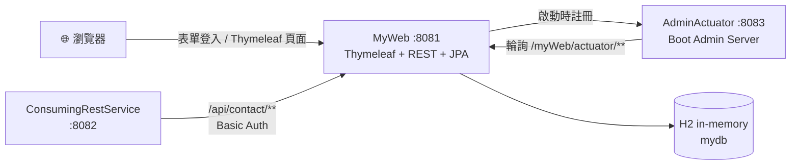

### 登入後的角色分流

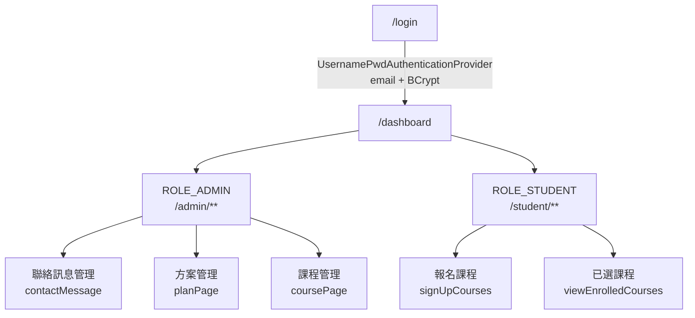

### 畫面截圖

> 展開下方分組可看其餘 9 張；所有截圖放在 [`docs/screenshots/`](./docs/screenshots)。

#### 首頁

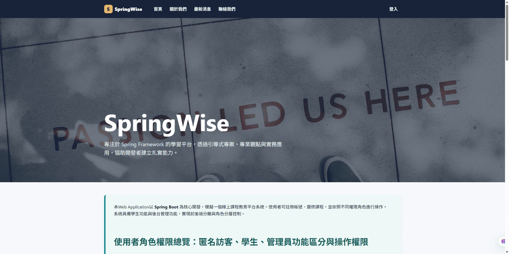

<details>
<summary><b>🔓 前台（不需登入）— 登入頁、註冊頁</b></summary>

<br>

**登入** — `/login`，由自訂的 `UsernamePwdAuthenticationProvider` 以 email + BCrypt 驗證

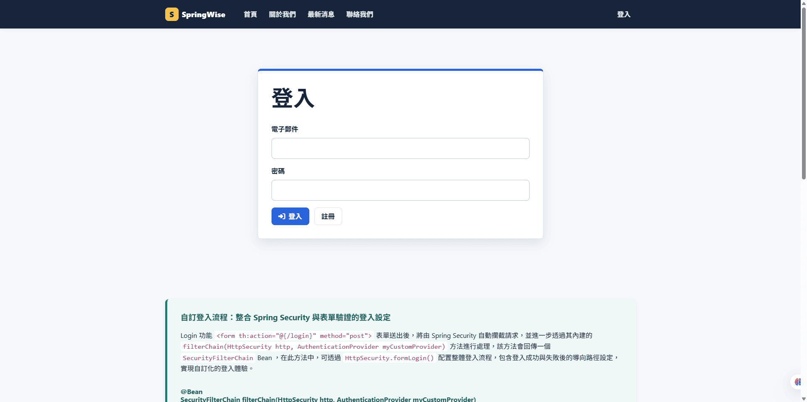

**註冊** — `/public/register`，表單 POST 到 `/public/createUser`，套用 `@PasswordValidator` 與 `@FieldValueMatchValidator`

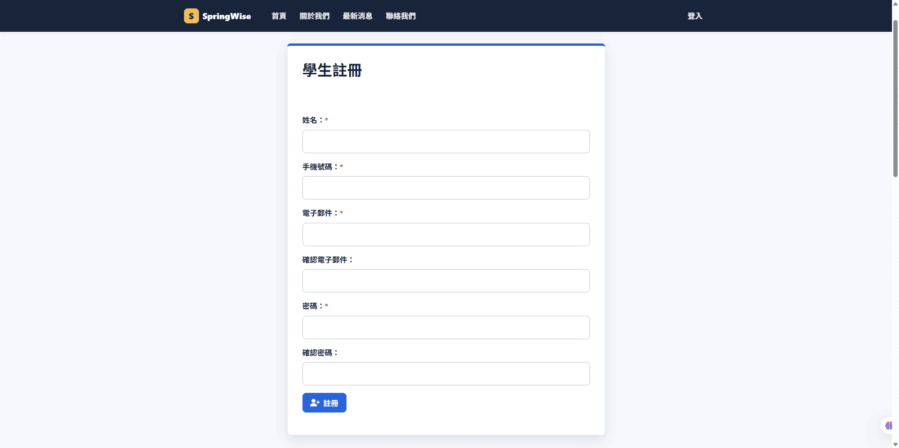

</details>

<details>
<summary><b>👤 登入後 — 個人儀表板、個人資料</b></summary>

<br>

**個人儀表板** — `/dashboard`，依角色顯示不同入口（圖為 `ROLE_ADMIN`，有「查看聯絡訊息／管理方案／管理課程」三張卡片）

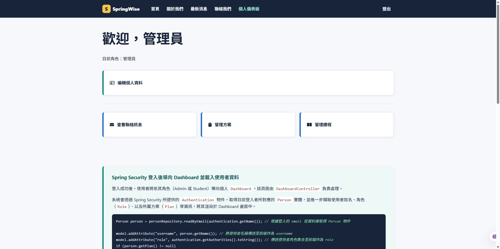

**個人資料** — `/profilePage`，以 `Profile` DTO（非 Entity）承載表單，含基本資料與地址資料

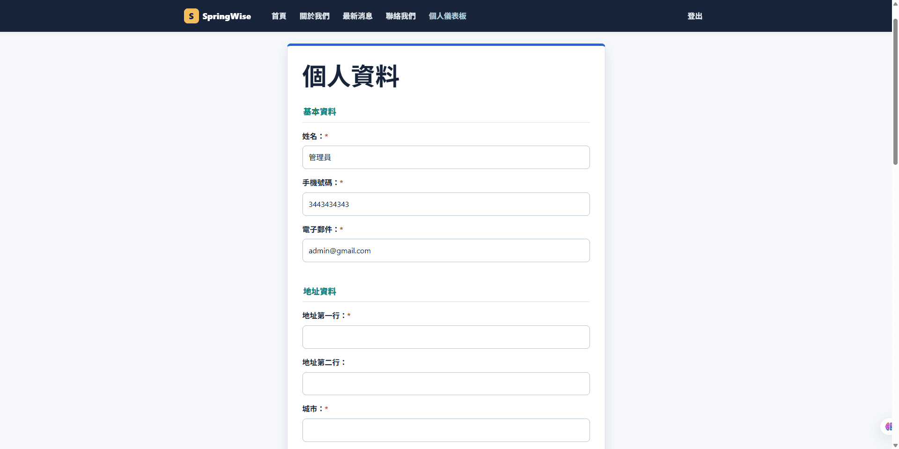

</details>

<details>
<summary><b>🛠️ 管理員後台 — 聯絡訊息、方案管理</b></summary>

<br>

**聯絡訊息** — `/admin/viewContactMessage/page/1`，**每頁 5 筆**（由 `myweb.paginationPageSize` 控制）、欄位可排序，右側「關閉」把狀態從 `OPEN` 改為 `CLOSED`

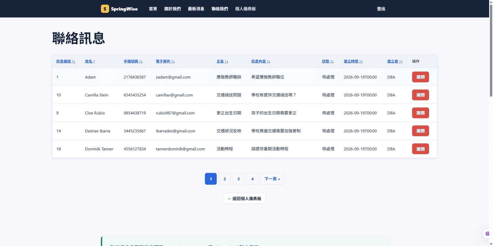

**方案管理** — `/admin/planPage`，`Plan` 的 CRUD；「查看」進入 `viewPlanDetail` 可增減該方案的學生

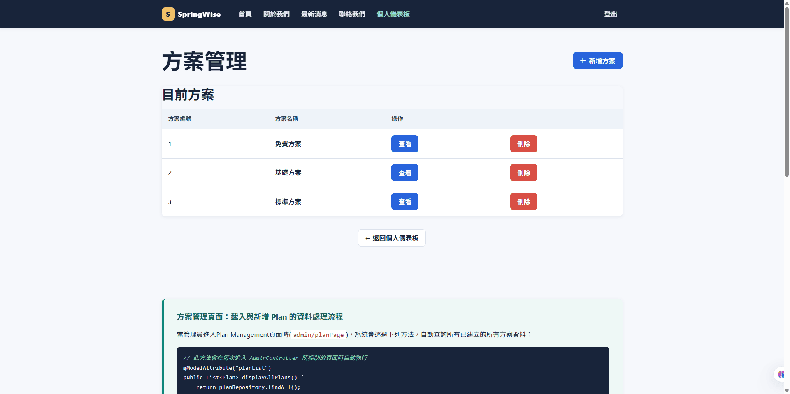

</details>

<details>
<summary><b>🎓 學生 — 選課</b></summary>

<br>

**可選課程** — `/student/signUpCourses`，勾選後批次購買；已報名的課程會被 disable（由 `alreadyRegisteredCourses` 判斷）

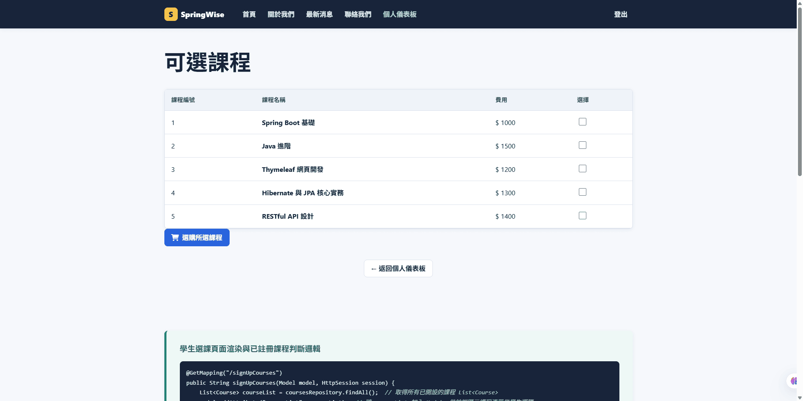

</details>

<details>
<summary><b>🔧 開發者工具 — HAL Explorer、Boot Admin</b></summary>

<br>

**HAL Explorer** — `/spring-data-api/`，Spring Data REST 自動產生端點的互動式瀏覽器（需 `ROLE_ADMIN`）

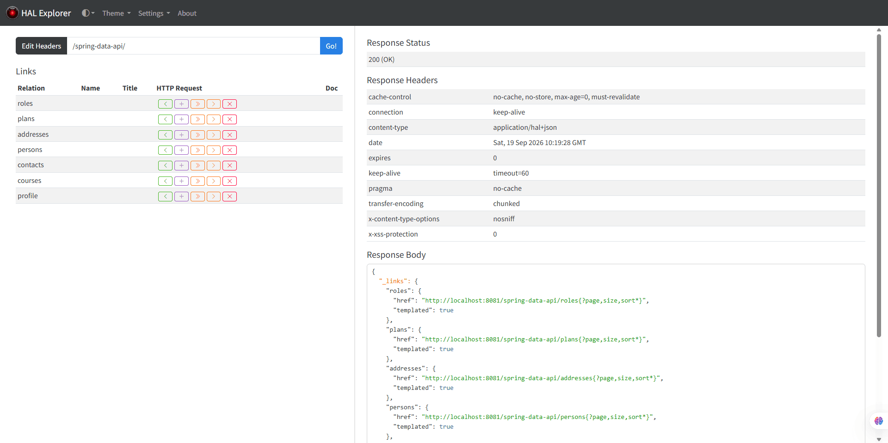

**Spring Boot Admin** — <http://localhost:8083>，可看健康狀態、執行緒、CPU、環境變數、Bean、Logfile；左側「日誌」分頁能**線上調整 log level 免重啟**

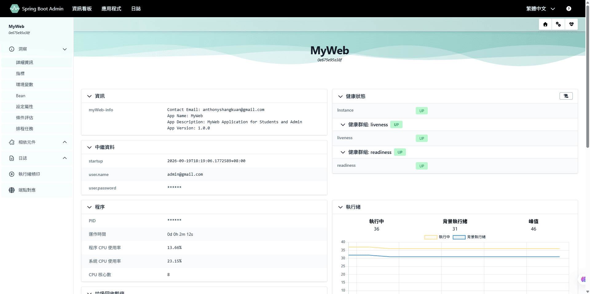

</details>

---

## 2. 系統架構與專案結構

### 模組間的通訊契約

```
┌────────────────────────────┐                              ┌──────────────────────────────┐
│ ConsumingRestService :8082 │                              │ MyWeb                  :8081 │
├────────────────────────────┤                              ├──────────────────────────────┤
│ [1] Feign         GET      │─ getContactMessageByStatus ─>│ /api/contact/**              │
│ [2] RestTemplate  POST     │───── saveContactMessage ────>│   requires ROLE_ADMIN        │
│ [3] WebClient     POST     │───── saveContactMessage ────>│                              │
│                            │                              │ Thymeleaf UI                 │
│ Basic Auth preset:         │                              │ Spring Data REST             │
│ admin@gmail.com / admin    │                              │ Spring Security              │
└────────────────────────────┘                              │ H2 (in-memory)               │
                                                            │                              │
┌────────────────────────────┐                              │ /myWeb/actuator/**           │
│ AdminActuator     :8083    │<─── [4] register on boot ────│   requires ROLE_ADMIN        │
├────────────────────────────┤                              │                              │
│ Boot Admin Server UI       │─── [5] poll (Basic Auth) ───>│                              │
└────────────────────────────┘                              └──────────────────────────────┘
```

| # | 呼叫 | 說明 |
|---|---|---|
| **[1]** | Feign → `GET /api/contact/getContactMessageByStatus` | 宣告式 client，`OpenFeignRestClient` 介面無實作，由 Feign 在執行期動態代理 |
| **[2]** | RestTemplate → `POST /api/contact/saveContactMessage` | 阻塞式呼叫，手動組 `HttpHeaders` + `HttpEntity` 再 `exchange()` |
| **[3]** | WebClient → `POST /api/contact/saveContactMessage` | 反應式呼叫，流暢 API 串接 `.header().body().retrieve()` |
| **[4]** | MyWeb **主動**向 8083 註冊 | 啟動時送出 service / management base-url |
| **[5]** | AdminActuator 反向定期輪詢 | Basic Auth 且 **無 session** — 每次輪詢都重新驗證一次 |

各模組的職責與依賴方向：

| 模組 | 對外提供 | 依賴誰 |
|---|---|---|
| **MyWeb** `:8081` | Thymeleaf UI、`/api/contact/**`、Spring Data REST、Actuator、H2、Spring Security | 無（可獨立啟動） |
| **ConsumingRestService** `:8082` | `/getMessages`、`/saveMessages`、`/saveMessagesWebClient` | **MyWeb**（三個 client 的目標網址都寫死在原始碼裡） |
| **AdminActuator** `:8083` | Boot Admin Server Web UI | 被 MyWeb 註冊，再反向持續輪詢 MyWeb |

**啟動相依性**：`MyWeb` 可獨立跑；`MyWeb` 預設會向 8083 註冊（`spring.boot.admin.client.enabled=true`），所以 **`AdminActuator` 建議先啟動**，否則 console 會一直刷連線失敗。

### 目錄結構

```
springboot-webapp/
├── MyWeb/                              # 主應用（8081）
│   └── src/main/
│       ├── java/com/company/myweb/
│       │   ├── MyWebApplication.java   # @SpringBootApplication + @EnableJpaAuditing + @EnableConfigurationProperties
│       │   ├── aspect/                 # LoggerAspect — @Around 計時、@AfterThrowing 記錄例外
│       │   ├── auditor/                # AuditAwareImpl — 提供 @CreatedBy / @LastModifiedBy 的值
│       │   ├── config/                 # MyWebConfig、MyWebProperties、GlobalExceptionHandler
│       │   │   └── security/           # SpringSecurityConfig、UsernamePwdAuthenticationProvider
│       │   ├── constant/               # ProjectConstant（ANSI 顏色碼、狀態常數）
│       │   ├── controller/             # @Controller（Thymeleaf）
│       │   │   └── authenticated/      # 登入後頁面：Dashboard / Profile / Admin / Student
│       │   ├── exception/              # 自訂例外
│       │   ├── model/                  # JPA Entity + 2 個「非 Entity」類別
│       │   ├── myValidation/           # 自訂 Bean Validation
│       │   ├── repository/             # Spring Data JPA Repository
│       │   ├── rest/                   # @RestController（/api/**）+ REST 例外處理
│       │   └── service/                # 寫入與跨 repository 的業務邏輯
│       └── resources/
│           ├── sql/schema.sql          # ⚠️ schema 的唯一真相（ddl-auto=validate）
│           ├── sql/data.sql            # 初始資料（含 BCrypt 加密的預設帳號）
│           ├── static/css/             # app.css → foundation / components / pages 三層 @import
│           └── templates/              # Thymeleaf；nav/、authenticated/、fragments/
│
├── ConsumingRestService/               # REST client 教學（8082）
│   └── src/main/java/com/company/ConsumingRestService/
│       ├── config/ProjectConfiguration.java   # 三個 client bean，各自預設 Basic Auth
│       ├── controller/ContactRestController.java
│       ├── dto/                        # Contact / Response（獨立複製的 POJO，非共用 jar）
│       └── proxy/
│           └── OpenFeignRestClient.java  # @FeignClient 宣告式介面
│
└── AdminActuator/                      # Boot Admin Server（8083）
    └── src/main/java/com/company/AdminActuator/
        └── AdminActuatorApplication.java      # 只有 @EnableAdminServer
```

### 資料模型

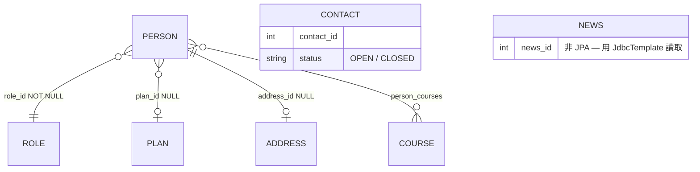

**怎麼看這張圖** — 線兩端的符號（鴉爪記號）表示「這一端可以有幾筆」，靠近誰就描述誰：

| 符號 | 讀作 |
|---|---|
| `\|\|` | 剛好一筆（必填） |
| `o\|` | 零或一筆（選填） |
| `}o` / `o{` | 零到多筆 |

逐條關聯：

| 關聯 | 讀法 | 外鍵位置 |
|---|---|---|
| `PERSON }o--\|\| ROLE` | 多個使用者共用一個角色；**每個使用者一定要有角色** | `person.role_id` **NOT NULL** |
| `PERSON }o--o\| PLAN` | 多個使用者可屬於同一方案；**也可以沒有方案** | `person.plan_id` **NULL** |
| `PERSON \|\|--o\| ADDRESS` | 一個使用者最多一筆地址；**註冊時不填，之後在個人資料補** | `person.address_id` **NULL** |
| `PERSON }o--o{ COURSE` | 一個學生可選多門課，一門課可被多人選 | 中介表 `person_courses` |
| `CONTACT`、`NEWS` | 獨立資料表，沒有任何外鍵 | 無 |

#### 這些關聯寫在哪

**四個關聯全部宣告在 `model/Person.java` 一個檔案裡** —— 因為外鍵欄位都在 `person` 表上：

```java
// Person.java

@ManyToOne(fetch = FetchType.EAGER, optional = false)      // 多對一，且必填
@JoinColumn(name = "role_id", nullable = false)            // 存進 person.role_id
private Role roles;                                        // 型別 Role → 指向 roles 表

@OneToOne(fetch = FetchType.EAGER, cascade = {CascadeType.MERGE})
@JoinColumn(name = "address_id")                           // 存進 person.address_id（可為 NULL）
private Address address;                                   // 型別 Address → 指向 address 表

@ManyToOne(fetch = FetchType.EAGER)                        // optional 預設 true → 選填，可為 null
@JoinColumn(name = "plan_id")                              // 存進 person.plan_id（nullable 預設 true）
private Plan plan;                                         // 型別 Plan → 指向 plan 表

@ManyToMany(fetch = FetchType.EAGER)
@JoinTable(name = "person_courses",                        // 中介表
        joinColumns = @JoinColumn(name = "person_id"),         // 我這側的欄位
        inverseJoinColumns = @JoinColumn(name = "course_id"))  // 對面那側的欄位
private Set<Course> courses = new HashSet<>();             // 型別 Course → 指向 courses 表
```

三個補充重點：

1. **外鍵全部集中在 `person` 表上** —— `role_id`、`address_id`、`plan_id` 三個欄位都在 `person`，所以 `PERSON` 是這張圖唯一的「中心」，其他表彼此不相連。
2. **`person_courses` 是純中介表** —— 只有 `person_id` + `course_id` 兩欄，並以兩者為**複合主鍵**，因此同一個學生無法重複報名同一門課（資料庫層級就擋掉）。
3. **`Person` 的四個關聯全都是 owning side** —— 判準是「誰身上有 `@JoinColumn` / `@JoinTable`」，也就是誰管著外鍵；因為外鍵都在 `person` 表，所以四個都歸 `Person`。其中兩個是**單向**（`Role`、`Address` 沒有指回 `Person` 的欄位，根本沒有 inverse side），另外兩個是**雙向** —— `Plan.persons`、`Course.persons` 標了 `mappedBy`，是**唯讀視角**，直接改動它們不會寫進資料庫（見 `AdminController.addStudent`：必須 `person.setPlan(...)` 再存 `Person` 才有效）。

| 類別 | 類型 | 注意事項 |
|---|---|---|
| `Person` | JPA Entity | 關聯**全部 `FetchType.EAGER`**；**刻意覆蓋** `BaseEntity.createdBy`，讓未登入註冊也能寫入 |
| `Role`、`Address`、`Plan`、`Course`、`Contact` | JPA Entity | `Plan.persons` 是唯一的 `LAZY` 關聯 |
| `BaseEntity` | `@MappedSuperclass` | 稽核欄位 `createdBy` / `createdAt` / `updatedBy` / `updatedAt` |
| `News` | **純 POJO** ⚠️ | 用 `JdbcTemplate` + `BeanPropertyRowMapper` 讀取，`news` 表只存在於 `schema.sql`。**勿加 `@Entity`** |
| `Profile` | **DTO** ⚠️ | 更新個人資料表單專用，不入庫 |

---

## 3. 核心功能與亮點

### 🔐 自訂認證流程，不是預設的 `UserDetailsService`

`UsernamePwdAuthenticationProvider` 直接實作 `AuthenticationProvider`，以 **email** 查 `person` 表、用 `BCryptPasswordEncoder` 比對，並手動組出 `ROLE_` 前綴的 `GrantedAuthority`。適合用來理解 Spring Security 的驗證鏈到底怎麼跑。

| 路徑 | 需要權限 |
|---|---|
| `/student/**` | `ROLE_STUDENT` |
| `/admin/**`、`/api/**`、`/spring-data-api/**`、`/myWeb/actuator/**` | `ROLE_ADMIN` |
| `/dashboard`、`/profilePage`、`/updateProfile` | 任何已登入使用者 |
| 其他（`/`、`/login`、`/public/**`、H2 console…） | `permitAll` |

### 🧩 同一份資料，四種存取風格並陳

這是本專案最主要的教學價值 — 同一個 `Contact` 資料，用四種方式對外：

| 風格 | 進入點 | 特色 |
|---|---|---|
| **Thymeleaf MVC** | `/contact` | 伺服器端渲染 HTML |
| **手寫 REST** | `/api/contact/**` | 完全掌控；**同時支援 JSON 與 XML**（依 `Accept` header 內容協商） |
| **Spring Data REST** | `/spring-data-api/**` | 零程式碼自動 CRUD + HAL Explorer |
| **三種 HTTP client** | 8082 的三個端點 | Feign（宣告式）／RestTemplate（阻塞）／WebClient（反應式） |

`ContactRepository` 更刻意示範了**四種查詢寫法對照**：Derived query、`@Query` JPQL、`@NamedQuery`、`@Modifying` UPDATE。

### 📖 每一頁都內嵌「這頁背後的 Spring 原理」

這是 SpringWise 最特別的地方 —— **15 個頁面各自帶一段教學說明**，放在 `templates/text/*Description.html`，以 Thymeleaf fragment 嵌在頁面下方，內容包含該頁用到的 Spring 機制與實際程式碼片段。例如：

| 頁面 | 說明的主題 |
|---|---|
| `dashboardDescription` | Spring Security 登入後如何導向 Dashboard 並從 `Authentication` 取回 `Person` |
| `planPageDescription` | `@ModelAttribute` 為何在每次進入頁面時自動執行 |
| `signUpCoursesDescription` | 多對多關聯下「已註冊課程」的判斷邏輯 |
| `viewPlanDetailDescription` | `Set<Person>` 的迴圈渲染與雙向關聯維護 |

也就是說，**這個 app 本身就是它自己的教材** — 操作畫面與原理解說在同一頁。

### 📊 AOP 全域執行時間記錄（含切點取捨）

`aspect/LoggerAspect` 的兩個 advice **切點範圍刻意不同**：

```java
@Around("businessLayer()")        // controller.. / rest.. / service.. — 只涵蓋業務層
@AfterThrowing("anyMyWebMethod()") // com.company.myweb..* — 例外全範圍記錄
```

原因是 actuator 走 Basic Auth 且**無 session**，Admin Server 每次輪詢都會重新驗證一次；若 `@Around` 全攔，單次輪詢就會刷出 7 行 log 並把 BCrypt hash 印進檔案。這是個「AOP 切點必須配合實際流量設計」的真實案例。

### 🏷️ 自訂 Actuator `/info` 內容

`config/MyWebActuatorInfoContributor` 實作 `InfoContributor`，Spring Boot 會自動偵測並把資料掛在 `myWeb-info` 這個 key 底下 —— 同時出現在 `/myWeb/actuator/info` 的 JSON 與 **Boot Admin 儀表板的「資訊」卡片**（見上方截圖）。

```java
@Component
public class MyWebActuatorInfoContributor implements InfoContributor {
    @Override
    public void contribute(Info.Builder builder) {
        builder.withDetail("myWeb-info", Map.of("App Name", "MyWeb", "App Version", "1.0.0", ...));
    }
}
```

### 📁 log 落檔 + 線上調整 log level

- log 同時輸出到 console（ANSI 彩色）與 `MyWeb/logs/myweb.log`
- 設定 `logging.file.name` 才會註冊 **`/myWeb/actuator/logfile`** 端點 → Boot Admin 的 **Logfile** 頁籤才有內容
- 檔案 pattern 用 `%replace` 剝掉訊息內嵌的 ANSI 碼，避免 log 檔出現 `[95m` 亂碼
- 想看 SQL 時**不要**用 `spring.jpa.show-sql`（它繞過 Logback），改用可線上開關的：

```bash
curl -u admin@gmail.com:admin -X POST -H "Content-Type: application/json" \
  -d '{"configuredLevel":"DEBUG"}' \
  http://localhost:8081/myWeb/actuator/loggers/org.hibernate.SQL
```

### 🗄️ `schema.sql` 是 schema 的唯一真相

`spring.jpa.hibernate.ddl-auto=validate` — Hibernate 只在啟動時**驗證** Entity 是否對應現有 schema，**不會**依 Entity 改動 DB。欄位不符就直接啟動失敗，強迫 `sql/schema.sql` 與 `model/` 保持同步。

### ✅ 自訂 Bean Validation

`myValidation/` 下有兩個自製 annotation：

- `@PasswordValidator` — 單欄位密碼強度
- `@FieldValueMatchValidator` — **class 層級**，用於檢查 `Person` 的 `password`/`confirmPassword` 與 `email`/`confirmEmail` 是否一致

（各自搭配一個 `*Impl` 實作 `ConstraintValidator`。）

### 🎨 CSS 三層架構

`templates/` 只 link `app.css`，由它以 `@import` 串接三層（順序即優先序）：

```
foundation.css   設計 token（顏色、字級、間距、breakpoint）
    ↓
components.css   跨頁重用的 BEM 元件（navbar、卡片、表單）
    ↓
pages.css        單一頁面的樣式覆寫
```

---

## 4. 技術棧

### 共通

| 項目 | 版本 / 說明 |
|---|---|
| Java | **25** |
| Spring Boot | **4.1.0**（`spring-boot-starter-parent`，三個模組各自宣告） |
| 建置工具 | Maven Wrapper（`mvnw` / `mvnw.cmd`）— 無需另外安裝 Maven |
| Lombok | `optional=true`；全 codebase 使用 `@Slf4j` / `@RequiredArgsConstructor` / `@Data` |

### MyWeb

| 領域 | 依賴 |
|---|---|
| Web | `spring-boot-starter-webmvc`（Boot 4 建議命名，取代已 deprecated 的 `starter-web`） |
| 安全 | `spring-boot-starter-security`（**Spring Security 7.1.0**，版本由 Boot BOM 管理）+ `thymeleaf-extras-springsecurity6` `3.1.5`（artifact 名仍是 `springsecurity6`，但相容 Security 7）|
| 視圖 | `spring-boot-starter-thymeleaf`（**Thymeleaf 3.1.5** + `thymeleaf-spring6` 整合層）— controller 回傳字串解析為 `templates/<name>.html`，devtools 會自動關閉 `spring.thymeleaf.cache` 以支援模板熱重載 |
| 持久層 | `spring-boot-starter-data-jpa`（Hibernate 7）+ `spring-boot-starter-data-rest` |
| 資料庫 | H2 in-memory + **`spring-boot-h2console`**（Boot 4 拆出的獨立模組） |
| 內容協商 | `jackson-dataformat-xml`（讓 `@RestController` 依 `Accept` 回 JSON 或 XML） |
| HAL Explorer | `spring-data-rest-hal-explorer` |
| 監控 | `spring-boot-starter-actuator` + `hibernate-micrometer`（groupId **`org.hibernate.orm`**）+ `spring-boot-admin-starter-client` **4.1.2** |
| 驗證 / 開發 | `spring-boot-starter-validation`、`spring-boot-devtools` |

> ⚠️ **AOP 沒有直接依賴。** `pom.xml` 裡**沒有** `spring-boot-starter-aop`；`LoggerAspect` 能運作是因為
> `spring-boot-starter-data-jpa` → `spring-boot-data-jpa` → `spring-aspects` → **`aspectjweaver 1.9.25.1`** 這條傳遞鏈。
> 若哪天移除或替換 JPA 依賴，aspect 會**無聲失效** — 那時請補上 `spring-boot-starter-aop`。

### ConsumingRestService

| 領域 | 依賴 |
|---|---|
| Spring Cloud | **2025.1.2（Oakwood release train）** — 對應 Boot 4.1 |
| 宣告式 client | `spring-cloud-starter-openfeign` |
| 阻塞式 client | **`spring-boot-starter-restclient`**（Boot 4 拆分後 `RestTemplateBuilder` 的所在模組） |
| 反應式 client | `spring-boot-starter-webflux`（提供 `WebClient`） |

### AdminActuator

依賴極簡 — 只有 `spring-boot-starter-webmvc` + `spring-boot-admin-starter-server` **4.1.2**。

> ⚠️ **版本鏈鎖定**：SBA 4.1.x 對應 Boot 4.1，且 client（`MyWeb`）與 server（`AdminActuator`）兩邊的 `spring-boot-admin.version` **必須一致**。

---

## 5. 快速開始與本地部署

### 環境需求

- **JDK 25**（三個 `pom.xml` 皆宣告 `<java.version>25</java.version>`）
- Port **8081**、**8082**、**8083** 未被佔用
- 網路連線（首次執行 Maven Wrapper 會下載依賴）
- 不需要安裝 Maven、不需要安裝資料庫（H2 為內嵌記憶體資料庫）

### 啟動

在**各自的終端機**執行（注意順序）：

```powershell
# 終端機 1：Boot Admin Server（8083）— 先啟動，否則 MyWeb 會一直刷註冊失敗
cd AdminActuator
.\mvnw.cmd spring-boot:run

# 終端機 2：主應用（8081）— 核心，一定要有
cd MyWeb
.\mvnw.cmd spring-boot:run

# 終端機 3：REST client（8082）— 要測 Feign / RestTemplate / WebClient 才需要
cd ConsumingRestService
.\mvnw.cmd spring-boot:run
```

> 只想跑主應用時，把 `MyWeb/src/main/resources/application.properties` 的
> `spring.boot.admin.client.enabled` 改成 `false`，就可以單獨啟動 `MyWeb` 而不噴連線錯誤。

### 預設帳號

`MyWeb/src/main/resources/sql/data.sql` 已插入兩個 BCrypt 加密的帳號：

| Email | Password | Role | 可存取 |
|---|---|---|---|
| `admin@gmail.com` | `admin` | `ROLE_ADMIN` | `/admin/**`、`/api/**`、`/spring-data-api/**`、Actuator |
| `student@gmail.com` | `123` | `ROLE_STUDENT` | `/student/**` |

### 主要入口

| 用途 | 網址 |
|---|---|
| 前端首頁 | <http://localhost:8081/> |
| 登入 | <http://localhost:8081/login> |
| **註冊** | <http://localhost:8081/public/register>（`PublicController` 有 class 層 `@RequestMapping("/public")`）|
| H2 Console | <http://localhost:8081/h2-console> — JDBC URL `jdbc:h2:mem:mydb`、User `sa`、Password 空白 |
| HAL Explorer | <http://localhost:8081/spring-data-api/> |
| Actuator | <http://localhost:8081/myWeb/actuator> |
| Boot Admin UI | <http://localhost:8083> |
| REST client 範例 | <http://localhost:8082/getMessages?status=OPEN> |

### 三十秒驗證全鏈路

```bash
# ① MyWeb 自己的 REST API（需 ROLE_ADMIN）
curl -u admin@gmail.com:admin "http://localhost:8081/api/contact/getContactMessageByStatus?status=OPEN"

# ② 透過 ConsumingRestService 的 Feign 轉發（8082 → 8081）
curl "http://localhost:8082/getMessages?status=OPEN"

# ③ 透過 RestTemplate 寫入
curl -X POST http://localhost:8082/saveMessages -H "Content-Type: application/json" \
  -d '{"name":"demo","mobile":"1234567890","email":"demo@example.com","subject":"s","message":"m","status":"OPEN"}'

# ④ 透過 WebClient 寫入
curl -X POST http://localhost:8082/saveMessagesWebClient -H "Content-Type: application/json" \
  -d '{"name":"demo2","mobile":"1234567890","email":"demo2@example.com","subject":"s","message":"m","status":"OPEN"}'

# ⑤ 健康檢查
curl -u admin@gmail.com:admin http://localhost:8081/myWeb/actuator/health
```

> ③ 與 ④ 都會回 **201** — 兩個端點都原樣傳遞上游 `MyWeb` 的狀態碼。

### 建置與打包

```powershell
.\mvnw.cmd clean package                      # 產物在 target/
java -jar target\MyWeb-0.0.1-SNAPSHOT.jar     # 執行打包好的 jar
```

---

## 6. 附錄

### 常用指令

在對應模組目錄下執行：

```powershell
.\mvnw.cmd spring-boot:run                     # 啟動（含 devtools 熱重載）
.\mvnw.cmd clean package                       # 建置
.\mvnw.cmd test                                # 全部測試
.\mvnw.cmd test "-Dtest=SomeTestClass"         # 單一測試類別
.\mvnw.cmd test "-Dtest=SomeTestClass#someMethod"  # 單一測試方法
.\mvnw.cmd resources:resources                 # 只更新 static/templates（免重啟）
```

> **PowerShell 引號**：`-Dtest=...` 必須用雙引號包住，否則 `#` 會被當成註解起點。

### 設定檔要點（`MyWeb/application.properties`）

| Property | 值 | 說明 |
|---|---|---|
| `server.port` | `8081` | HTTP port |
| `logging.file.name` | `MyWeb/logs/myweb.log` | 相對於**工作目錄 = repo 根**；`pom.xml` 的 `spring-boot-maven-plugin` 設了 `<workingDirectory>${project.basedir}/..</workingDirectory>` 讓 IDE 與 Maven 兩種啟動方式一致 |
| `spring.datasource.url` | `jdbc:h2:mem:mydb;DB_CLOSE_DELAY=-1;DB_CLOSE_ON_EXIT=FALSE` | `DB_CLOSE_DELAY=-1` 讓 devtools restart / HikariCP 回收連線時 DB 不被銷毀 |
| `spring.jpa.hibernate.ddl-auto` | `validate` | 只驗證、不動 DB |
| `spring.jpa.properties.jakarta.persistence.validation.mode` | `none` | 關閉持久層 Bean Validation（避免對已加密的密碼重複驗證）。**用 `jakarta.*`，舊的 `javax.*` 已棄用** |
| `spring.data.rest.basePath` | `/spring-data-api` | Spring Data REST 前綴 |
| `management.endpoints.web.base-path` | `/myWeb/actuator` | Actuator base path |
| `management.endpoints.web.exposure.include` | `*` | 開放全部端點（**生產環境請改白名單**） |
| `spring.boot.admin.client.enabled` | `true` | 向 8083 註冊 |
| `myweb.paginationPageSize` | `5` | 後台分頁筆數（`@Validated` 限制 5–10） |

新增可調參數請集中在 `config/MyWebProperties`（前綴 `myweb.*`），不要用 `@Value` 散落各處。

### 測試現況

- **框架**：JUnit 5 + Spring Boot Test + Spring Security Test
- **命名慣例**：測試類 `*Tests`；測試方法以行為描述，例：`registerRejectsDuplicateEmail()`
- **現況**：`src/test/java` 除了空的 `*ApplicationTests` 外尚無內容 — 這是待補的區塊

### Boot 4 / Java 25 升級筆記

升級過程中踩到、非 obvious 的點：

- **`spring-boot-starter-web` 已 deprecated** → 三個模組都改用 `spring-boot-starter-webmvc`
- **Boot 4 拆分了 autoconfigure 模組**，常用類別搬家：
  | 類別 | 舊路徑 | 新路徑 |
  |---|---|---|
  | `@EntityScan` | `…autoconfigure.domain` | `org.springframework.boot.persistence.autoconfigure` |
  | `PathRequest`（servlet） | `…autoconfigure.security.servlet` | `org.springframework.boot.security.autoconfigure.web.servlet` |
  | `RestTemplateBuilder` | `…boot.web.client` | `org.springframework.boot.restclient` |
  | H2 Console | 內含於 autoconfigure | 獨立模組 `spring-boot-h2console` |
- **Hibernate groupId 變更**：`hibernate-micrometer` 的 groupId 是 `org.hibernate.orm`；版本交給 Boot BOM，勿硬編碼
- **Java 23+ 停用預設的 classpath 隱式 annotation processing** → `maven-compiler-plugin` 必須顯式宣告 Lombok 的 `<annotationProcessorPaths>`，否則 `@Slf4j`、`@Data` 不生效

### Troubleshooting

| 症狀 | 原因與解法 |
|---|---|
| 啟動時 `Schema-validation: missing table/column` | `ddl-auto=validate` 抓到 `sql/schema.sql` 與 Entity 不一致 — 同步兩邊 |
| 呼叫 `/api/**` 回 **401** | 沒帶 Basic Auth 或權限不足（需 `ROLE_ADMIN`） |
| `/public/register` 以外的註冊網址回 **404** | 註冊頁在 `/public/register`，表單 POST 到 `/public/createUser` |
| `ConnectException: Connection refused`（8082 的任一端點） | 三個 client 的目標都寫死 `http://localhost:8081` — 先啟動 `MyWeb` |
| console 一直刷 `authenticate` 與 SQL | Admin Server 正在輪詢；已透過收斂 `LoggerAspect` 切點與移除 `show-sql` 解決 — 若復發，檢查這兩處 |
| Boot Admin UI 看不到 `MyWeb` | 確認 `spring.boot.admin.client.enabled=true` 且 `AdminActuator` 已在 8083 啟動 |
| `@Slf4j` / `@Data` 未生效 | `maven-compiler-plugin` 缺少 Lombok annotation processor 宣告 |
| `/h2-console` 回 404 | 確認 `pom.xml` 有 `spring-boot-h2console` 依賴且 `spring.h2.console.enabled=true` |
| log 檔跑到 repo 根而不是 `MyWeb/logs/` | 啟動時的工作目錄不是 repo 根 — 見上方「設定檔要點」 |
| Windows PowerShell 中文亂碼 | 啟動前執行 `chcp 65001`，或改用 Windows Terminal |

### 授權

本專案為個人學習用途，未附加授權條款。
